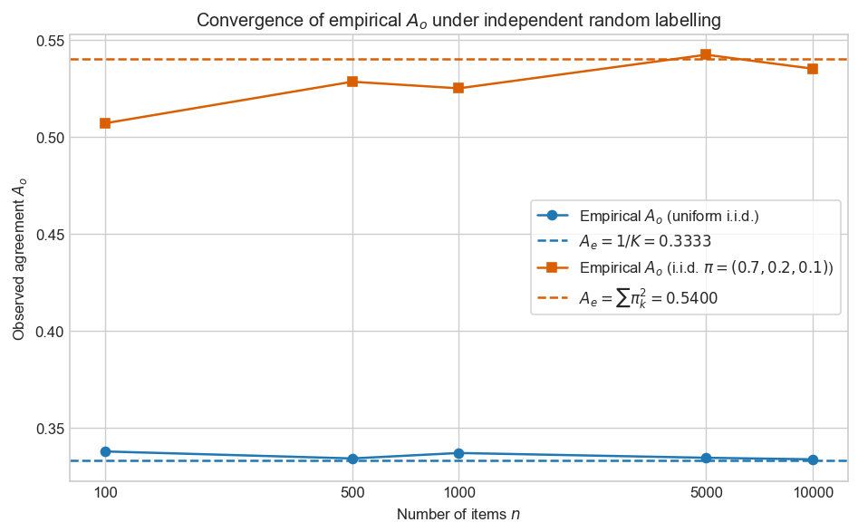
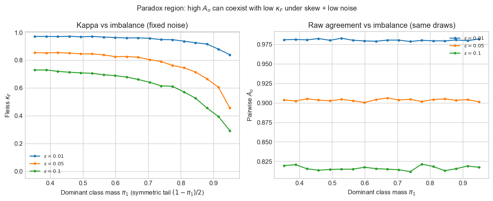
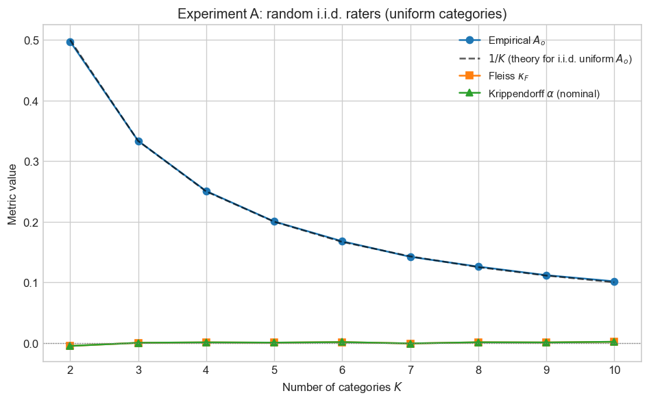
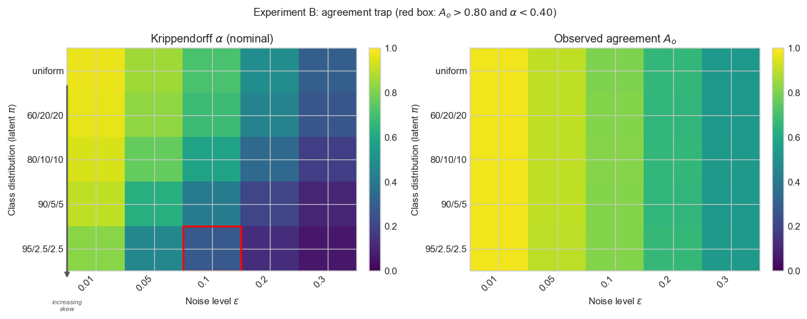
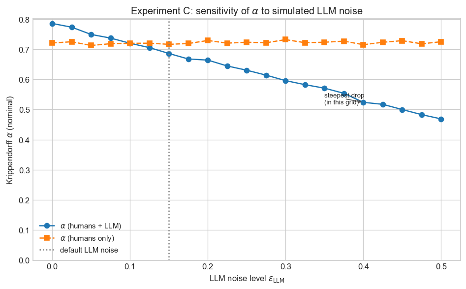
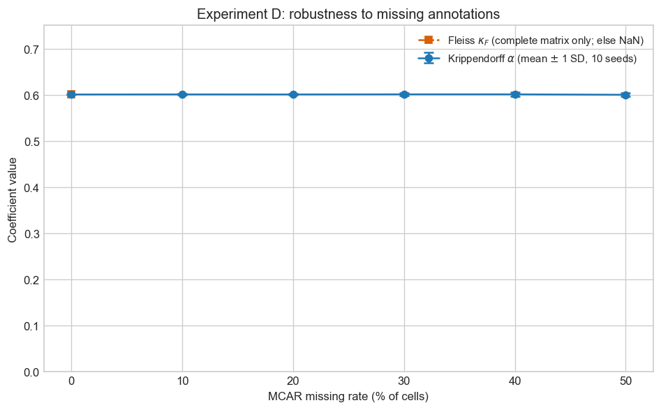

# When Agreement Is an Illusion

*Statistical foundations of inter-annotator agreement — from observed agreement to Krippendorff's Alpha.*

> **Thesis.** An agreement score of 0.80 among annotators is more likely evidence of structured noise and prevalence than of true consensus when chance agreement is not properly accounted for. Metrics like raw agreement treat overlap as signal; Krippendorff's Alpha models **disagreement** under a randomness benchmark and generalises across raters, missing data, and measurement scales.

---

## 1. Introduction

Your annotators agreed on 80% of the items. The dashboard turns green; the model is cleared for production. That number is **almost certainly misleading** as a summary of reliability.

Raw **observed agreement** answers a narrow question: what fraction of comparable rater pairs gave the same label? It does **not** answer: would independent annotators with similar marginal behaviour already agree that often? When the answer to the second question is yes, a large first number says little about whether annotators share a stable reading of the task. It may mostly reflect **prevalence** (one category dominates) and **sampling**, not a deep consensus.

This matters acutely for **LLM evaluation**. Suppose a workplace pipeline asks humans and a fine-tuned model to assign projects to brand categories. Product and legal teams want a single coefficient: "Do we agree?" If you report only the proportion of agreeing (human, LLM) pairs, a model that shadows the majority class can look excellent while adding no careful judgement. The same pitfall appears in clinical coding, content moderation, and any setting with skewed labels and cost-sensitive errors.

Computational linguistics has relied on agreement coefficients since the era of corpus annotation for parsing and coreference (Artstein and Poesio, 2008). The community's maturity about $\kappa$ is uneven: leaderboards still mix **accuracy-style** summaries with **prevalence-heavy** tasks. As **foundation models** become default labellers, the question is less "did we hit 80%?" and more "does this automation **track** human exchangeability under the same instructions?" That reframing pushes toward coefficients that tolerate **partial** observation and respect **scale**.

This article follows one narrative arc:

1. Formalise agreement as an **estimator** and separate **signal** from **chance** (Sections 2–3).
2. Introduce **Cohen's** and **Fleiss'** $\kappa$ as the standard correction, then show where they **break** (Sections 4–5).
3. Reframe reliability through **disagreement** and the **coincidence matrix**, leading to **Krippendorff's** $\alpha$ (Sections 6–7).
4. **Validate** the story with four controlled simulations (Section 8).
5. Close with a **practical decision lens** and honest limits (Sections 9–10).

Notation is fixed throughout: $K$ categories, $n$ items (units), $m$ raters unless stated otherwise. The annotation matrix is $(X_{ij})$ with $X_{ij} \in \{1,\ldots,K\}$ in this article (code may use zero-based indices). Missing judgments are allowed where noted.

The intended reader has met linear algebra and basic probability; no measure-theoretic machinery is required. Proofs of boundary cases for $\alpha$ are stated at the level of **structure** (what must happen to the coincidence masses) rather than as long epsilon–delta arguments. Where a formula matches the implementation in the companion repository, we point to the phase notes (`notes/phase1-theory.md` through `phase3-alpha.md`) for line-by-line alignment with code.

---

## 2. Agreement as an estimator

### 2.1 The annotation problem

We observe a **reliability study**: several raters assign one of $K$ **nominal** categories to each of $n$ items. No gold standard is assumed; the goal is to quantify how consistently raters **exchange** the same judgments when faced with the same content. That is **reliability** (replicability of the measurement process), not **validity** (whether categories match the world).

Reliability can be high while validity is poor (everyone applies the same wrong rubric) and vice versa. This article **only** addresses the former: we ask whether the **annotation procedure** is stable across people and, by extension, whether an automated system that mimics those people is aligned with them in a **replicable** sense. Claims about ground truth or downstream utility require additional evidence.

### 2.2 Pairwise observed agreement

Fix an item $i$. Let $S_i$ be the set of unordered rater pairs $(j,\ell)$, $j<\ell$, such that **both** $X_{ij}$ and $X_{i\ell}$ are observed. Define an agreement indicator $I_{ij\ell} = 1$ if $X_{ij} = X_{i\ell}$, else $0$.

The **observed agreement** is the fraction of comparable pairs that agree:

$$
A_o = \frac{\displaystyle\sum_{i=1}^n \sum_{(j,\ell)\in S_i} I_{ij\ell}}{\displaystyle\sum_{i=1}^n |S_i|}.
$$

So $A_o$ is a **sample proportion** of agreeing pairs, pooled over items. It estimates the probability that two randomly drawn **observed** ratings on the **same** item match, under the implicit design that weights each eligible pair equally.

**Worked example (three items, two raters).** Items 1 and 3 agree; item 2 disagrees. Then $A_o = 2/3$.

### 2.3 Global agreement: pooling judgments with replacement

Some reporting pipelines use an alternative **global** summary: pool all observed judgments, let $N$ be the pool size and $n_k$ the count for category $k$, and imagine drawing **two judgments uniformly at random with replacement** from the pool. The probability both draws equal $k$ is $(n_k/N)^2$, so

$$
P(\text{agree}) = \sum_{k=1}^K \Bigl(\frac{n_k}{N}\Bigr)^2.
$$

This quantity coincides with the pairwise-within-item $A_o$ in simple balanced designs but **diverges** when the number of raters varies by item or missingness is uneven. It remains useful as an intuitive "overall overlap" index and matches the $\sum_k p_k^2$ algebra that reappears in Fleiss' expected agreement $\bar P_e$. The companion code implements both variants so experiments can be checked against the definition you standardise in your protocol.

### 2.4 What $A_o$ estimates — and what it misses

$A_o$ is a transparent **descriptive** statistic. What it is **not** is a calibrated measure of "how much better than chance" the panel behaves. Two independent annotators who each draw labels from a skewed distribution $\pi$ will still agree with probability $\sum_k \pi_k^2$, often far above zero. If your reported $A_o$ is close to that quantity, the data are compatible with **independence**, not with a shared latent truth.

Like any binomial-style proportion, $A_o$ has **sampling variability**. Wide items and sparse rare classes can make point estimates noisy; the experiments in Section 8 use $n=10{,}000$ items partly to make curves visually stable. In applied work, complement point estimates with **confidence intervals** (bootstrap over items is common) and with **disaggregated** views (per-stratum agreement, confusion matrices).

Hence the framing: treat $A_o$ as an **estimator** of overlap under your sampling scheme, and always ask what **benchmark** it should be compared to. Section 3 formalises the usual benchmark: **expected agreement under independence** with fixed marginals.

---

## 3. The chance agreement problem

### 3.1 Expected agreement under independence

**Model.** Two annotators assign labels **independently**, each following the same category distribution $\pi = (\pi_1,\ldots,\pi_K)$, $\pi_k \ge 0$, $\sum_k \pi_k = 1$. Then

$$
A_e = P(\text{both pick the same category}) = \sum_{k=1}^K \pi_k^2.
$$

For **uniform** $\pi_k = 1/K$, we get $A_e = K \cdot (1/K)^2 = 1/K$. With $K=2$, independent coin-flip labellers agree half the time **with no shared truth**. With $K=3$, $A_e = 1/3$.

**Imbalanced example.** If $\pi = (0.7, 0.2, 0.1)$,

$$
A_e = 0.7^2 + 0.2^2 + 0.1^2 = 0.54.
$$

Prevalence alone pushes the independence baseline upward.

| Setting | $A_e = \sum_k \pi_k^2$ |
|---------|-------------------------|
| $K=2$, uniform | $0.50$ |
| $K=3$, uniform | $1/3 \approx 0.333$ |
| $K=3$, $\pi=(0.7,0.2,0.1)$ | $0.54$ |

The third row is the **warning shot** for applied reports: **more than half** of independent draws would already match even though three categories exist.

### 3.2 Random annotators: why $A_o$ does not go to zero

Suppose every matrix entry is drawn **independently** from $\pi$ (no shared latent item truth). Then two ratings on the same item are independent draws from $\pi$, and the probability they agree is **exactly** $A_e = \sum_k \pi_k^2 > 0$ for any non-degenerate $\pi$.

So **"random" does not mean "zero agreement"**; it means agreement at the **chance** level implied by the marginals. Any headline that cites $A_o$ without that context risks overstating reliability.

### 3.3 Empirical check: convergence to $\sum_k \pi_k^2$

Phase 1 of the companion codebase simulates **purely random** i.i.d. annotators and tracks $A_o$ as the number of items grows. The simulation matches the theory: empirical agreement concentrates on $\sum_k \pi_k^2$. The exercise is deliberately **austere**: there is no latent item difficulty, no instruction drift, and no correlation across raters beyond what independence implies. If real data looked like this simulation, the right conclusion would be that the annotation process carries **no item-specific signal** in the strong sense of the model. Real studies usually violate those assumptions — which is exactly why we need coefficients that **separate** structured agreement from prevalence-driven overlap.



**Figure 1.** Random i.i.d. annotators: empirical observed agreement approaches the theoretical expected agreement $A_e = \sum_k \pi_k^2$ as sample size increases.

The implication is clear: $A_o$ alone cannot distinguish between genuine consensus and prevalence-driven overlap. We need a correction that **subtracts** the chance baseline before interpreting what remains. That is exactly what the Kappa family provides.

---

## 4. The Kappa family

### 4.1 The chance-correction pattern

Given an observed agreement $A_o$ and an expected agreement $A_e$ under a stated **chance model**, define

$$
\kappa \;=\; \frac{A_o - A_e}{1 - A_e}.
$$

When $A_e < 1$:

- $\kappa = 1$ if $A_o = 1$ (perfect overlap).
- $\kappa = 0$ if $A_o = A_e$ (overlap matches the baseline).
- $\kappa < 0$ if $A_o < A_e$ (worse than the baseline).

Different coefficients differ in how $A_o$ and $A_e$ are operationalised. The denominator $1-A_e$ rescales the excess agreement so that $\kappa$ lives on a **comparable** scale across tasks with different baselines: the same raw gap $A_o - A_e$ means more when chance agreement was already rare than when it was ubiquitous. That rescaling is intellectually satisfying but also explains why $\kappa$ can swing dramatically when **small changes** in rare-class counts move $A_e$: the coefficient is **ratio-based**, not variance-stabilised.

### 4.2 Cohen's $\kappa$ (two fixed raters)

Two annotators rate the same $n$ items: $X_{i1}, X_{i2} \in \{1,\ldots,K\}$.

**Observed agreement:**

$$
A_o \;=\; \frac{1}{n}\sum_{i=1}^n \mathbf{1}\{X_{i1}=X_{i2}\}.
$$

**Expected agreement** uses the **empirical** rater marginals. Let $p_{k\cdot} = \frac{1}{n}\sum_i \mathbf{1}\{X_{i1}=k\}$ and $p_{\cdot k} = \frac{1}{n}\sum_i \mathbf{1}\{X_{i2}=k\}$. Under independence with those marginals,

$$
A_e \;=\; \sum_{k=1}^K p_{k\cdot}\,p_{\cdot k}.
$$

**Cohen's kappa:** $\kappa_C = (A_o - A_e)/(1-A_e)$.

**Worked $2\times 2$ example (three items).** With encodings A/B giving $A_o = 2/3$ and marginals $(2/3, 1/3)$ vs $(1/3, 2/3)$, one obtains $A_e = 4/9$ and $\kappa_C = 0.4$.

Cohen's $\kappa$ is **symmetric** in the two raters for this definition and is widely implemented (e.g. scikit-learn). Its weakness for modern annotation is structural: **only two** fixed individuals, no native slot for "sometimes three crowd workers, sometimes two," and ad hoc handling of missing pairs by **dropping** items. Those limitations are acceptable in classic test–retest studies; they bite in crowdsourcing and LLM–human panels.

### 4.3 Fleiss' $\kappa$ (several raters per item)

There are $n$ items and $m$ raters per item (balanced design). For item $i$, let $n_{ik}$ be the count of raters who chose category $k$ ($\sum_k n_{ik} = m$).

**Extent of agreement on item $i$:**

$$
P_i \;=\; \frac{1}{m(m-1)}\sum_{k=1}^K n_{ik}(n_{ik}-1),
$$

the fraction of **unordered** rater pairs on item $i$ that agree.

**Mean observed agreement:** $\bar P = \frac{1}{n}\sum_i P_i$.

**Pooled category proportions:** $p_k = \frac{1}{nm}\sum_i n_{ik}$.

**Expected agreement:** $\bar P_e = \sum_k p_k^2$ (same functional form as Section 3 when all judgments share one marginal).

**Fleiss' kappa:** $\kappa_F = (\bar P - \bar P_e)/(1 - \bar P_e)$.

**Tiny sanity check ($n=2$ items, $m=3$ raters, $K=2$).** Item 1 with label counts $(2,1)$ gives $P_1 = (2\cdot 1 + 1\cdot 0)/(3\cdot 2) = 1/3$. Item 2 with counts $(0,3)$ gives $P_2 = 1$. Hence $\bar P = (1/3 + 1)/2 = 2/3$. Pooling six judgments yields $p_0 = 1/3$, $p_1 = 2/3$, so $\bar P_e = (1/3)^2 + (2/3)^2 = 5/9$ and $\kappa_F = (2/3 - 5/9)/(1 - 5/9) = (1/9)/(4/9) = 0.25$. The hand calculation matches the unit tests in the codebase — a useful anchor when debugging new simulation pipelines.

### 4.4 Why Kappa helps

Both $\kappa_C$ and $\kappa_F$ **re-express** overlap relative to a **data-driven** chance baseline. When $A_o$ is high only because $\bar P_e$ is high, $\kappa_F$ moves toward zero, signalling that apparent harmony is largely **prevalence-driven**. That is the right direction for interpretation — until the baseline and structural assumptions themselves become inadequate (Section 5).

---

## 5. Limitations of Kappa

### 5.1 The Kappa paradox

When one category is **very prevalent**, independent raters still agree often because $\bar P_e = \sum_k p_k^2$ is dominated by $p_{\text{major}}^2$. A high **raw** agreement can therefore coexist with **low** $\kappa$: the coefficient is doing its job, but readers who only track $A_o$ feel a **paradox**.

Clinicians have long documented **"high agreement but low kappa"** scenarios (Feinstein and Cicchetti, 1990): the statistical structure is the same **prevalence inflation** of the chance baseline. The paradox is not a quirk of one subfield — it is the predictable algebra of $\sum_k p_k^2$ when one $p_k$ nears one.

The companion codebase sweeps imbalance at fixed noise; Fleiss' $\kappa$ can sit far below raw agreement while $A_o$ stays in the "excellent" band on naive scales. The figure is not a proof; it is a **visual reminder** that **ranking models** by raw agreement can invert a ranking by $\kappa_F$ when class balance differs across conditions.



**Figure 2.** As the majority-class mass grows, expected agreement under independence grows with it; $\kappa_F$ can fall sharply even when naive overlap remains high.

### 5.2 Structural constraints

| Limitation | Cohen | Fleiss |
|------------|-------|--------|
| Number of raters | Exactly **two** | Same $m \ge 2$ for every item |
| Missing data | Not native | **Complete** matrix typically required |
| Scale | **Nominal** | **Nominal** (weighted variants exist) |

Ordinal, interval, and ratio data can be squeezed into nominal bins or **weighted** $\kappa$, but there is no single Kappa object that natively carries **metric** distances between categories while handling **variable** numbers of judgments and **missing** cells in one framework.

### 5.3 Building the case for $\alpha$

We need a coefficient that:

1. Compares observed **disagreement** to a **chance** level of disagreement under a clear random pairing model.
2. Allows **missing** ratings without discarding entire items arbitrarily.
3. Supports **distances** between values (ordinal steps, squared interval gaps, ratio penalties).

Krippendorff's $\alpha$ is built for that role. It does not erase the need for careful **study design**: if instructions are ambiguous, no coefficient will rescue interpretability. What $\alpha$ offers is a **single algebraic skeleton** that extends from nominal through ratio scales and respects **pairable** information only — the same philosophical move as using **effective sample sizes** in other parts of statistics.

---

## 6. From agreement to disagreement

### 6.1 Why shift the lens

Raw agreement and Kappa-style numerators count **matches**: how many pairs gave the same label? An equivalent dual view counts **mismatches** weighted by how far apart the assigned categories are. For nominal data, "distance" is binary — same or not. For interval data, squared differences penalise large errors more than small ones. This dual view turns out to be more general: it naturally accommodates **measurement scales** beyond the nominal and leads to a single formula that unifies all cases.

### 6.2 The reliability matrix

Krippendorff's construction starts from a **reliability matrix**: rows are **units** (items), columns are **raters**, entries are values (categories or numeric scores). Missing entries are **excluded** from all calculations; only pairs of distinct raters on the same unit contribute information. A unit with a single observed label cannot form a pair and is silently dropped — no imputation, no row deletion.

### 6.3 Building the coincidence matrix — a worked example

Consider three items rated by three annotators on a binary domain $\{A, B\}$:

| Unit | Rater 1 | Rater 2 | Rater 3 |
|------|---------|---------|---------|
| 1    | A       | A       | B       |
| 2    | B       | B       | —       |
| 3    | A       | A       | A       |

**Step 1 — count vectors.** For each unit, count how many times each value appears among **observed** ratings:

- Unit 1: $\mathbf{n}_1 = (2, 1)$, with $m_1 = 3$ raters.
- Unit 2: $\mathbf{n}_2 = (0, 2)$, with $m_2 = 2$ raters (Rater 3 is missing).
- Unit 3: $\mathbf{n}_3 = (3, 0)$, with $m_3 = 3$ raters.

**Step 2 — local coincidence contributions.** For each unit, the contribution to the coincidence matrix is proportional to how often pairs of **distinct** raters assigned each combination of values. For a unit with count vector $\mathbf{n}_i$, the off-diagonal entry $(c, c')$ receives $n_{ic} \cdot n_{ic'}/(m_i - 1)$, and the diagonal entry $(c, c)$ receives $n_{ic}(n_{ic} - 1)/(m_i - 1)$. The denominator $m_i - 1$ ensures that each unit contributes **one unit of total mass** regardless of how many raters observed it.

Applying this to our example:

- **Unit 1** ($m_1 = 3$): diagonal $(A,A) = 2 \cdot 1 / 2 = 1$; diagonal $(B,B) = 1 \cdot 0 / 2 = 0$; off-diagonal $(A,B) = 2 \cdot 1 / 2 = 1$.
- **Unit 2** ($m_2 = 2$): diagonal $(B,B) = 2 \cdot 1 / 1 = 2$; all other entries zero.
- **Unit 3** ($m_3 = 3$): diagonal $(A,A) = 3 \cdot 2 / 2 = 3$; all other entries zero.

**Step 3 — sum to get $\mathbf{O}$.** Add the contributions across units:

|       | A   | B   |
|-------|-----|-----|
| **A** | 4   | 1   |
| **B** | 1   | 2   |

The marginals are $n_A = 5$, $n_B = 3$, and the total pairable mass is $N = 8$.

**Step 4 — expected coincidence $\mathbf{E}$.** Under the null hypothesis that pairs are formed by random re-pairing of the same marginal totals, the expected matrix entries are $E_{cc'} = (n_c n_{c'} - n_c \delta_{cc'}) / (N - 1)$. For instance, $E_{AB} = (5 \cdot 3) / 7 \approx 2.14$ and $E_{AA} = (5 \cdot 4) / 7 \approx 2.86$.

### 6.4 From coincidence to disagreement

The **observed disagreement** is the weighted sum $D_o^* = \sum_{c,c'} O_{cc'} D_{cc'}$, where $D_{cc'} = \delta(c, c')$ encodes distance. The **expected disagreement** $D_e^*$ uses $\mathbf{E}$ in the same formula. The ratio $D_o^* / D_e^*$ tells us how the panel's actual pattern of mismatches compares to what random pairing would produce.

The conceptual shift is simple: instead of "how often do we agree?", ask **"how much farther apart are we than random pairing would predict?"** Agreement is the special case in which distance is zero on the diagonal and one elsewhere (nominal $\delta$). Section 7 assembles these pieces into the full $\alpha$ formula.

---

## 7. Krippendorff's Alpha

### 7.1 Definition

Let $\delta(c,c')$ be a **metric** between category values (nominal, ordinal, interval, ratio — see below). Let $\mathbf{D}$ have entries $D_{cc'} = \delta(v_c, v_{c'})$ on an ordered value domain $(v_1,\ldots,v_V)$.

From the data, build the **observed coincidence matrix** $\mathbf{O}$ (symmetric, nonnegative) and the **expected** matrix $\mathbf{E}$ under the random-pairing null that preserves marginal totals derived from $\mathbf{O}$. Define scalar disagreements

$$
D_o^\* = \sum_{c,c'} O_{cc'}\,D_{cc'},
\qquad
D_e^\* = \sum_{c,c'} E_{cc'}\,D_{cc'}.
$$

**Krippendorff's alpha** is

$$
\alpha = 1 - \frac{D_o^\*}{D_e^\*}.
$$

When $D_e^\*$ is zero (degenerate case), $\alpha$ is not defined as a finite ratio.

### 7.2 Building $\mathbf{O}$ (sketch)

For each unit $i$ with $m_i \ge 2$ observed judgments, form the count vector $\mathbf{n}_i = (n_{i1},\ldots,n_{iV})$ of how many raters used each domain value. Unnormalised co-occurrence is related to $\mathbf{n}_i\mathbf{n}_i^\top$ with the diagonal adjusted so self-pairs from the **same** rater do not count. Scale by $1/(m_i-1)$ and sum over units. **Missing** raters are dropped before forming $\mathbf{n}_i$; no pair is formed with a missing cell.

Concretely, for a single unit with three raters and counts $(2,1,0)$ on domain $(v_1,v_2,v_3)$, the adjustment subtracts rater self-pairs from the outer product of counts, then divides by $m_i-1$. The resulting local matrix contributes off-diagonal mass where **cross-category** pairings occur; the diagonal records **within-category** pairings that survive the subtraction. Summing these contributions over **all** units yields $\mathbf{O}$. The implementation in the repository follows Krippendorff (2004) and is cross-checked against the `krippendorff` Python package on reference reliability matrices.

### 7.3 Expected coincidence

Let $n_c$ be marginals derived from $\mathbf{O}$ and $N = \sum_c n_c$ the total pairable mass. Under the standard null,

$$
E_{cc'} = \frac{n_c n_{c'} - n_c\,\delta_{cc'}}{N-1},
$$

symmetric and aligned with sampling-without-replacement intuition on pair slots.

### 7.4 Distance functions

- **Nominal:** $\delta(c,c') = 0$ if $c=c'$, else $1$.
- **Interval:** $(c-c')^2$.
- **Ratio:** $\bigl((c-c')/(c+c')\bigr)^2$ (with convention at $c+c'=0$).
- **Ordinal:** uses the ordered domain and category masses (not plain rank gaps without weights); see Krippendorff (2004, Ch. 11).

### 7.5 Boundary behaviour

Assume $D_e^\* > 0$.

- **Perfect reliability** (for nominal $\delta$, all pairable judgments on a unit coincide): off-diagonal mass vanishes appropriately, $D_o^\* = 0$, hence $\alpha = 1$.
- **Chance-level** disagreement: $D_o^\* = D_e^\*$ implies $\alpha = 0$.
- **Systematic** disagreement beyond the null: $D_o^\* > D_e^\*$ implies $\alpha < 0$.

**Reading $\alpha$ as a scaled excess.** When $D_e^\* > 0$, rearrange $\alpha = 1 - D_o^\*/D_e^\*$ as

$$
\alpha = \frac{D_e^\* - D_o^\*}{D_e^\*}.
$$

So $\alpha$ is the **fractional reduction** of observed disagreement relative to the expected matrix under the null — analogous in spirit to how $\kappa$ expresses excess agreement relative to $1-A_e$, but built on **metric** weights rather than a single scalar $A_o$. Negative $\alpha$ means the pattern of weighted distances is **more discordant** than random pairing would predict under fixed exposure, a warning sign of **systematic** divergence (ambiguous guidelines, adversarial items, or instrument drift).

### 7.6 Relation to Cohen's $\kappa$

Cohen's $\kappa$ uses **per-rater** marginals on the same items. Krippendorff's $\alpha$ uses **pooled** coincidence marginals from $\mathbf{O}$. For **two** raters and **nominal** data, both correct for chance, but the **numerical value** need not equal $\kappa_C$ when $K>2$: the chance models differ. In practice, report **one** coefficient and stick to its interpretation, or compare both explicitly in a sensitivity table.

### 7.7 Software and reproducibility

The article's claims about $\alpha$ are backed by `krippendorff_alpha()` in the companion package, validated against published examples and the reference library. **Nominal**, **interval**, **ratio**, and **ordinal** levels are implemented with explicit **value domains** so that unused categories do not distort distances. When you port formulas into another language, the fragile details are usually the **ordinal** weights and the treatment of **all-missing** units — test against the reference package before trusting edge cases.

### 7.8 Ordinal and interval scales in practice

For **interval** ratings (e.g. 1–5 Likert), squaring differences in $\delta$ penalises **large** jumps more harshly than small ones — a natural match when errors farther apart are substantively worse. For **ordinal** labels, Krippendorff's construction uses the empirical totals $n_v$ to weight distances between **steps** on the ordered domain; this avoids the mistake of treating ordered categories as if they were equally spaced numbers unless your measurement theory supports that identification. In **NLP**, many "scales" are ordinal by design (fine-grained sentiment buckets); reporting **nominal** $\alpha$ on those buckets is conservative with respect to order information, while **ordinal** $\alpha$ uses more structure and therefore demands **defensible** spacing assumptions encoded in the value domain.

With the definition, construction, and boundary properties of $\alpha$ in place, the next step is empirical: do these properties hold in controlled simulations, and how does $\alpha$ compare to $A_o$ and $\kappa_F$ when we can compute ground-truth expectations?

---

## 8. Experiments

Four simulations (Phase 4 of the codebase) isolate properties of $A_o$, $\kappa_F$, and $\alpha$. All use **fixed seeds** and are reproducible via `make experiments` or the individual `scripts/experiment_*.py` commands.

They are **synthetic** on purpose: closed-form targets exist for random labelling, and grids over noise and imbalance are cheap to repeat. Translating the qualitative lessons to a live LLM API requires additional layers (calibration, adversarial prompts, human factors) that fall outside this draft — but the **algebraic** pitfalls of raw agreement and the **structural** limits of Fleiss remain.

### 8.1 Experiment A: random annotators

**Setup.** Pure i.i.d. labelling (`pure_random=True`), uniform categories, noise-free independence. Sweep $K \in \{2,\ldots,10\}$ with $n=10{,}000$, $m=5$.

**Expectation.** $A_o \approx 1/K$; $\kappa_F \approx 0$; $\alpha \approx 0$.

**Result.** Empirical curves match theory within tight tolerance; for $K=3$, all three metrics sit near the predicted baseline. This is the **sanity check** that chance-corrected coefficients vanish when there is no shared structure beyond independence.

The sweep over $K$ also illustrates a **presentation hazard**: if you only report $A_o$ and vary the number of categories between studies, the **raw** scale moves with $1/K$ even when behaviour is "maximally uninformative" in the $\kappa/\alpha$ sense. Normalising by the independence baseline — what Kappa and $\alpha$ encode differently — is not optional for cross-study comparison.



**Figure 3.** Random annotators: observed agreement tracks $1/K$; $\kappa_F$ and $\alpha$ track zero.

### 8.2 Experiment B: high agreement trap

**Setup.** Severe class skew (several latent $\pi$ presets) and low annotation noise on a five-rater panel. Grid over imbalance and $\varepsilon$.

**Expectation.** Regions where **raw** $A_o$ stays high but $\alpha$ (and $\kappa_F$) fall — the **trap** central to the thesis.

**Result.** Heatmaps of $A_o$ and $\alpha$ show a visible wedge where $A_o > 0.8$ while $\alpha < 0.4$. A spotlight table (script output) pairs a concrete $(\pi, \varepsilon)$ with numeric $A_o$, $\kappa_F$, and $\alpha$ for direct quotation in prose.

This is the article's **hero pattern**: stakeholders see a **comfortable** raw percentage while the chance-corrected coefficients whisper that the panel is only modestly better than a prevalence-aware random benchmark. The rhetorical lesson is operational: put **both** views in the same table by default, not in an appendix.



**Figure 4.** Agreement trap: high raw overlap coexists with low chance-corrected reliability under skew + low noise.

### 8.3 Experiment C: LLM versus humans (synthetic)

**Setup.** Three "human" annotators with noise $\varepsilon = 0.10$ and one "LLM" annotator with $\varepsilon = 0.15$ on a three-class task; sensitivity over LLM noise in $[0, 0.5]$.

**Metrics.** Observed agreement, Fleiss' $\kappa$ on the full panel, $\alpha$ on humans-only vs full panel, and pairwise Cohen's $\kappa$ between each human and the LLM column.

**Result.** $\alpha$ and related summaries **track** panel quality; adding a noisier rater tends to **reduce** panel $\alpha$ relative to humans-only. The sensitivity curve makes the dose–response visible for the synthetic noise parameter (a stand-in for model quality, not a claim about a specific API).

Pairwise Cohen $\kappa$ between each human and the LLM column gives a **local** picture; Fleiss on the full matrix answers a **global** panel question. None of these numbers replace **error analysis** on disagreements, but together they prevent a single proportion from monopolising the narrative.



**Figure 5.** Synthetic LLM vs humans: $\alpha$ responds to injected LLM noise; compare humans-only to full panel.

### 8.4 Experiment D: missing data

**Setup.** Fixed balanced panel with moderate noise; inject MCAR missingness from 0% to 50%.

**Expectation.** Fleiss' formulation (complete matrix) becomes **undefined** or **NaN** once entries are missing; $\alpha$ **degrades gracefully** because it is defined on pairable units.

**Result.** $\alpha$ remains stable near its complete-data value while Fleiss drops out — a practical reason to prefer $\alpha$ in sparse annotation regimes.

Real annotators quit mid-batch, merge requests split reviewer pools, and LLM calls time out. A metric that requires **imputation** or **row deletion** to return a number invites silent bias. $\alpha$'s pairwise coincidence logic is not magic — if missingness is **informative**, no coefficient is safe — but it avoids **structural** failure modes of complete-case Fleiss.



**Figure 6.** Missing data: $\alpha$ stays informative; Fleiss requires a complete matrix.

### 8.5 Synthesis

Together, the experiments support the thesis: **raw agreement misleads** under independence and skew; **Kappa** partially corrects but inherits structural limits; **$\alpha$** handles missingness and unifies disagreement-based thinking — validated here on synthetic ground truth where expectations are analytic or visually clear.

---

## 9. A practical framework

### 9.1 When to use which metric

- **Report $A_o$** as a **transparent** prevalence-sensitive summary, **always** alongside a chance-aware coefficient.
- **Cohen's $\kappa$** when there are **exactly two** fixed raters, **complete** data, and **nominal** (or weighted) categories.
- **Fleiss' $\kappa$** when every item has the **same** number of raters and the matrix is **complete**.
- **Krippendorff's $\alpha$** when you have **missing** judgments, **variable** numbers of raters per unit, or you need **ordinal/interval/ratio** distances in one framework.

### 9.2 Decision flowchart (ASCII)

```text
                    Start: reliability study
                              |
              Do you have missing ratings or varying m_i per unit?
                     /                              \
                   Yes                              No
                    |                                |
         Prefer Krippendorff's alpha          Exactly 2 fixed raters?
         (pick level: nominal / ordinal /              /            \
          interval / ratio)                          Yes            No
            |                                        |              |
            |                                   Cohen's kappa   Same m, complete grid?
            |                                                      /        \
            |                                                    Yes        No
            |                                            Fleiss' kappa   -> alpha
            v
     Report alpha with clear value domain and distance;
     optionally also report Ao and a Kappa where valid for comparison.
```

### 9.3 Thresholds (with caveats)

No universal magic cutoff replaces domain judgment. Rules of thumb in the literature (e.g. Landis and Koch) were not built for modern skewed NLP corpora. Treat any **single** threshold as **heuristic**: use confidence intervals, **sensitivity** to prevalence, and **error analysis** on disagreed items. If $\alpha \ll 0$ while $A_o$ is high, prioritise **prevalence and chance** explanations before celebrating reliability.

### 9.4 Reporting checklist

When writing the methods section of a paper or an internal model card:

1. State **which** agreement definition you use (within-item pairs vs global pool).
2. Report **$A_o$** (or equivalent) **and** at least one **chance-aware** coefficient appropriate to your design.
3. Disclose **$K$**, **approximate class frequencies**, and **missingness** rates.
4. For $\alpha$, name the **measurement level** (nominal vs ordinal, …) and the **value domain**.
5. Archive **code and seeds** so figures and tables recompute.

### 9.5 What agreement coefficients cannot fix

$\alpha$ is not a substitute for **clear coding rules**, **training**, or **pilot studies**. If two groups of annotators apply different mental models of the task, you may still see **depressed** $\alpha$ with confusion concentrated on a handful of ambiguous items — the right response is often **iterative guideline revision**, not more data. Coefficients also do not detect **biased** agreement: everyone could agree on the wrong answer (low validity, potentially high reliability). Finally, **non-independent** raters — discussing labels in a chat, copying neighbours, or sharing model outputs — violate the independence assumptions baked into chance models. The fix is **protocol design** (isolation, rotation, blinded conditions), not post-hoc algebra.

---

## 10. Conclusion

We opened with a deliberately uncomfortable claim: **high agreement is easy to manufacture**. Independent raters with skewed marginals agree often; raw $A_o$ encodes that fact without labelling it as chance. Cohen's and Fleiss' $\kappa$ subtract a **prevalence-aware** baseline and improve interpretation, yet they buckle under **imbalance paradoxes**, **missing data**, and **inflexible** nominal scaffolding.

Krippendorff's $\alpha$ reframes the question around **disagreement** weighted by meaningful distances, with a coincidence construction that absorbs **partial** observation patterns. The four experiments show, in controlled settings, that $\alpha$ **behaves** as theory demands when annotators are random, **flags** the high-$A_o$ trap, responds to **panel composition**, and **survives** missingness where Fleiss cannot.

For **ML practice**, the actionable message is procedural: **never** ship a single agreement percentage without stating the **chance benchmark**; **prefer** coefficients that match your **sampling** and **scale**; and **invest** in disagreement audits — especially when an LLM's agreement with humans is used as a proxy for safety or quality. Reliability is not the absence of large numbers; it is the **distance** between what you observe and what **random pairing** would produce.

The opening hook — eighty percent is misleading — is not cynicism about human annotation. It is a reminder that **good faith** and **high overlap** are different random variables. The coefficients here, especially $\alpha$, are tools for keeping that distinction visible when stakes are high.

---

## References

1. Cohen, J. (1960). A coefficient of agreement for nominal scales. *Educational and Psychological Measurement*, 20(1), 37–46. [doi:10.1177/001316446002000104](https://doi.org/10.1177/001316446002000104)
2. Fleiss, J. L. (1971). Measuring nominal scale agreement among many raters. *Psychological Bulletin*, 76(5), 378–382. [doi:10.1037/h0031619](https://doi.org/10.1037/h0031619)
3. Feinstein, A. R., & Cicchetti, D. V. (1990). High agreement but low kappa: I. The problems of two paradoxes. *Journal of Clinical Epidemiology*, 43(6), 543–549. [doi:10.1016/0895-4356(90)90158-L](https://doi.org/10.1016/0895-4356(90)90158-L)
4. Krippendorff, K. (2004). *Content Analysis: An Introduction to Its Methodology* (2nd ed.). Sage. ISBN 978-0-7619-1544-7.
5. Artstein, R., & Poesio, M. (2008). Inter-coder agreement for computational linguistics. *Computational Linguistics*, 34(4), 555–596. [doi:10.1162/coli.07-034-R2](https://doi.org/10.1162/coli.07-034-R2)
6. Landis, J. R., & Koch, G. G. (1977). The measurement of observer agreement for categorical data. *Biometrics*, 33(1), 159–174. [doi:10.2307/2529310](https://doi.org/10.2307/2529310)
7. Krippendorff, K. (2011). Computing Krippendorff’s Alpha-Reliability. *Departmental Papers (ASC)*, University of Pennsylvania. [Available online](https://repository.upenn.edu/asc_papers/43/)
