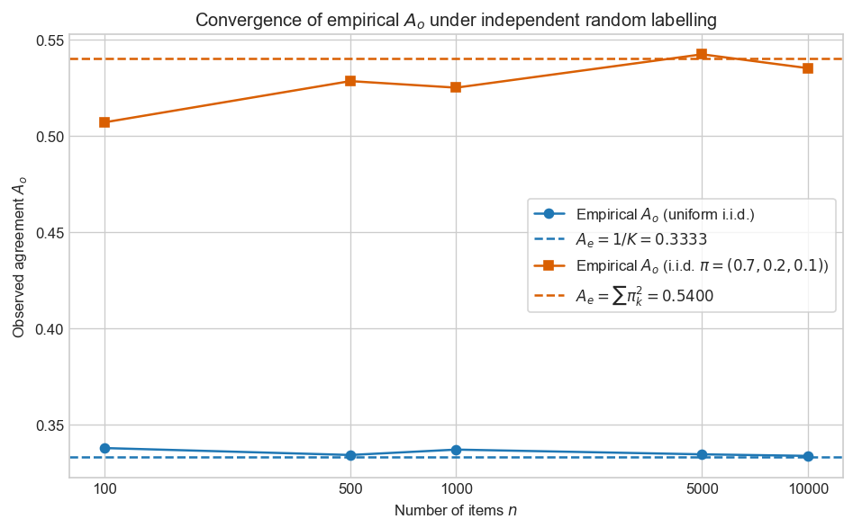
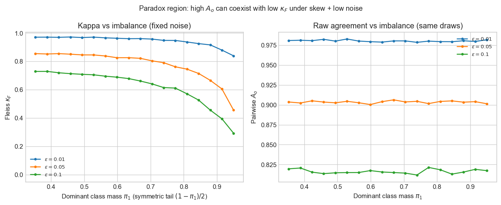
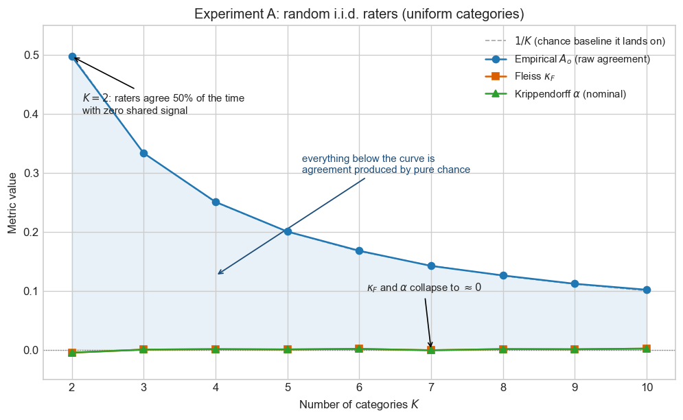
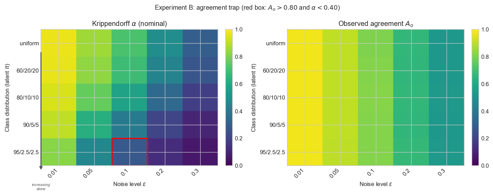
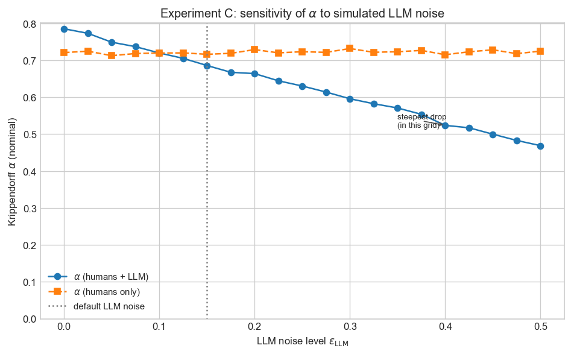

# Quando o acordo é uma ilusão

> **O que é isto.** Um índice de acordo de 0,80 pode enganar quando o acordo por acaso não é modelado explicitamente. Sob desbalanceamento de classes e marginais independentes, uma sobreposição observada alta emerge sem entendimento compartilhado. Este artigo percorre os fundamentos estatísticos do acordo entre anotadores — do acordo observado bruto, passando pela família Kappa e por onde ela quebra, até o alpha de Krippendorff, que modela **desacordo** frente a um referencial de aleatoriedade e generaliza para vários anotadores, dados faltantes e escalas de medição. Ele nasceu de um projeto de trabalho onde um painel de humanos discordava entre si enquanto um LLM era perfeitamente consistente — e a conclusão tentadora "confie no modelo, ele é consistente" se revelou estatisticamente frágil.
>
> **O que você deve saber antes de ler.** Probabilidade básica (distribuições, esperança) e conforto com somatórios e notação matricial. Nenhum contato prévio com coeficientes de acordo é assumido — cada um é construído do zero.
>
> **O que você vai levar.** Por que o acordo bruto engana sob desbalanceamento, como os Kappa de Cohen e Fleiss corrigem o acaso e onde falham, e como o alpha de Krippendorff unifica o quadro entre anotadores, dados faltantes e escalas de medição — além de um procedimento de decisão sobre qual coeficiente reportar.
>
> **Código.** Os coeficientes, simulações e figuras reproduzem a partir do [repositório companheiro](https://github.com/brunoramosmartins/krippendorff-alpha-article) com sementes fixas.
>
> **Notação.** $K$ categorias, $n$ itens (unidades), $m$ anotadores salvo indicação em contrário. A matriz de anotação é $(X_{ij})$ com $X_{ij} \in \{1,\ldots,K\}$; julgamentos faltantes são permitidos quando indicado.

---

## Introdução

Deixa eu começar pelo momento que me jogou nessa toca de coelho.

Um pequeno painel de analistas trabalha numa fila de itens. A tarefa parece trivial: ler cada descrição curta e jogar o item numa de poucas categorias. Para ir mais rápido, demos a mesma fila a um LLM com um prompt fixo. Meu modelo mental ao entrar era o óbvio — os analistas são a referência, o modelo é um substituto barato deles.

Aí as etiquetas voltaram e se recusaram a cooperar. Os analistas não concordavam entre si. O mesmo item caía em categorias diferentes dependendo de quem lia. O LLM, por outro lado, não se mexia: mesmo prompt, mesma resposta, toda vez. Então em quem você confia — nos humanos que discordam, ou na máquina que nunca vacila?

O argumento que surgiu na sala era sedutor, e ouvi versões dele muitas vezes desde então: o modelo é ao menos *consistente*, e as pessoas claramente não são, então talvez a gente devesse simplesmente confiar no modelo. Soa como puro bom senso. É também, até onde consigo enxergar, exatamente onde o raciocínio silenciosamente desmorona — e entender por quê é sobre o que trata este artigo inteiro.

O problema mora numa palavra só. **Ser consistente não é a mesma coisa que estar certo, e um número de acordo alto não te diz qual dos dois você tem.** Um modelo que responde "categoria A" toda vez é perfeitamente consistente e completamente inútil. E duas pessoas que não compartilham entendimento nenhum ainda podem concordar na maioria das vezes, só porque uma categoria é comum e elas fatalmente colidem nela. Acordo, no fim das contas, é barato. Você consegue muito dele por prevalência, por taxas de categoria desbalanceadas, ou por puro acaso — sem nada por baixo.

Então a pergunta que eu de fato precisava responder não era "com que frequência eles concordam?". Era: **quando as pessoas discordam e a máquina é consistente, como eu sei se essa consistência significa alguma coisa?** É essa a pergunta em torno da qual este artigo foi construído, e cada seção é um passo rumo a respondê-la:

- Por que o acordo bruto não consegue respondê-la sozinho — dois anotadores independentes, humanos ou modelo, concordam a uma taxa fixada por nada além do balanço de classes (*O acordo como estimador*, *O problema do acordo por acaso*).
- Os $\kappa$ de Cohen e Fleiss, que subtraem essa taxa de acaso — e as condições bagunçadas do dia a dia onde eles tropeçam, que são exatamente as condições em que meu painel estava (*A família Kappa*, *Limitações do Kappa*).
- O $\alpha$ de Krippendorff, que vira a pergunta do avesso para o *desacordo* e continua funcionando quando você tem muitos anotadores, etiquetas faltando e escalas ordenadas (*Do acordo ao desacordo*, *O alpha de Krippendorff*).
- Quatro pequenas simulações onde sabemos a verdade de antemão, para ver esses números se comportarem (*Experimentos*).
- E um guia prático com seus limites honestos — incluindo o incômodo que esta história toda é de fato sobre: mesmo um $\alpha$ perfeito não pode te dizer que o modelo consistente está *certo* (*Um guia prático*).

Mantenha esse painel no fundo da cabeça. Cada coeficiente aqui é, no fim, só uma resposta diferente ao que aqueles analistas estavam de fato nos dizendo.

---

## O acordo como estimador

### O problema da anotação

Consideramos um estudo de confiabilidade em que múltiplos anotadores atribuem uma de $K$ categorias nominais a cada um de $n$ itens. Este cenário parece enganosamente simples. Na prática, corresponde com frequência a tarefas como categorizar itens de trabalho por descrições textuais, atribuir etiquetas em pipelines de NLP, ou avaliar saídas de modelos frente ao julgamento humano — o tipo de trabalho de corpus que a linguística computacional mede com coeficientes de acordo desde Artstein e Poesio (2008).

Crucialmente, **nenhuma verdade de referência é observada diretamente**. O que observamos é uma coleção de julgamentos humanos, cada um moldado por interpretação, ambiguidade e viés individual. Não estamos medindo acurácia — estamos medindo a **consistência** de um processo de medição sob aplicação repetida.

No exemplo que motiva a introdução, anotadores diferentes discordavam com frequência sobre o mesmo item — não por descuido, mas porque a própria tarefa admitia múltiplas interpretações plausíveis. O LLM, por contraste, impunha uma única interpretação via prompt fixo. Isso destaca o objeto central de estudo: **confiabilidade não é sobre correção, mas sobre se o processo é reproduzível entre agentes**.

Essa distinção entre **confiabilidade** (replicabilidade do procedimento) e **validade** (se as categorias correspondem ao mundo) é fundamental. A confiabilidade pode ser alta enquanto a validade é pobre — todos aplicam o mesmo guia errado — e vice-versa. Este artigo trata **apenas** de confiabilidade. Afirmações sobre verdade de referência ou utilidade a jusante exigem evidência adicional.

Se anotadores discordam, o problema não é necessariamente que o acordo está baixo — pode ser que a tarefa não defina uma única verdade latente.

Formalmente, representamos os dados como uma matriz de anotação $(X_{ij})$, onde $X_{ij} \in \{1,\ldots,K\}$ é a etiqueta atribuída pelo anotador $j$ ao item $i$. Entradas faltantes são permitidas, refletindo cenários reais de anotação em que nem todo anotador etiqueta todo item.

### Acordo observado por pares

Fixe um item $i$. Seja $S_i$ o conjunto de pares não ordenados de anotadores $(j,\ell)$, $j<\ell$, tais que **ambos** $X_{ij}$ e $X_{i\ell}$ estão observados. Defina um indicador de acordo $I_{ij\ell} = 1$ se $X_{ij} = X_{i\ell}$, senão $0$.

O **acordo observado** é a fração de pares comparáveis que concordam:

$$
A_o = \frac{\displaystyle\sum_{i=1}^n \sum_{(j,\ell)\in S_i} I_{ij\ell}}{\displaystyle\sum_{i=1}^n |S_i|}.
$$

Assim, $A_o$ é uma **proporção amostral** de pares concordantes, agregada pelos itens. Ele estima a probabilidade de que duas avaliações **observadas**, sorteadas ao acaso no **mesmo** item, coincidam, sob o desenho implícito que dá peso igual a cada par elegível.

**Exemplo trabalhado (três itens, dois anotadores).** Os itens 1 e 3 concordam; o item 2 discorda. Então $A_o = 2/3$.

### Acordo global: agrupando julgamentos com reposição

Alguns pipelines de relatório usam um resumo **global** alternativo: agrupam todos os julgamentos observados, seja $N$ o tamanho do pool e $n_k$ a contagem da categoria $k$, e imaginam sortear **dois julgamentos uniformemente ao acaso com reposição** do pool. A probabilidade de ambos os sorteios darem $k$ é $(n_k/N)^2$, logo

$$
P(\text{acordo}) = \sum_{k=1}^K \Bigl(\frac{n_k}{N}\Bigr)^2.
$$

Essa quantidade coincide com o $A_o$ por pares dentro do item em desenhos simples e balanceados, mas **diverge** quando o número de anotadores varia por item ou a falta de dados é desigual. Ela continua útil como um índice intuitivo de "sobreposição geral" e casa com a álgebra $\sum_k p_k^2$ que reaparece no acordo esperado $\bar P_e$ de Fleiss. O código companheiro implementa ambas as variantes, para que os experimentos possam ser conferidos contra a definição que você padronizar no seu protocolo.

### O que $A_o$ estima — e o que não capta

$A_o$ é uma estatística **descritiva** transparente. O que ele **não** é: uma medida calibrada de "quanto melhor que o acaso" o painel se comporta. Dois anotadores independentes que sorteiam etiquetas de uma distribuição enviesada $\pi$ ainda concordam com probabilidade $\sum_k \pi_k^2$, muitas vezes bem acima de zero. Se o $A_o$ que você reporta está perto disso, os dados são compatíveis com **independência**, não com uma verdade latente compartilhada.

Como qualquer proporção do tipo binomial, $A_o$ tem **variabilidade amostral**. Itens amplos e classes raras esparsas podem tornar as estimativas pontuais ruidosas; os experimentos abaixo usam $n = 10\,000$ itens em parte para manter as curvas visualmente estáveis. Na prática, complemente estimativas pontuais com **intervalos de confiança** (bootstrap sobre itens é comum) e com vistas **desagregadas** (acordo por estrato, matrizes de confusão).

Daí o enquadramento: trate $A_o$ como um **estimador** de sobreposição sob o seu esquema amostral, e pergunte sempre contra qual **referencial** ele deveria ser comparado.

### Dois processos geradores de dados

Os experimentos deste artigo se apoiam em dois modelos generativos distintos. Confundi-los leva a interpretações erradas, por isso os enunciamos explicitamente.

**Modelo 1 — Etiquetagem puramente aleatória (sem sinal).** Cada anotador sorteia $X_{ij} \sim \pi$ de forma independente. Não há verdade latente por item; o acordo surge **apenas** das marginais compartilhadas. Este modelo é a hipótese nula para a análise do acordo por acaso e para o Experimento A.

**Modelo 2 — Anotação ruidosa em torno de uma verdade latente.** Cada item $i$ tem uma etiqueta verdadeira latente $Y_i \sim \pi$. Cada anotador observa $Y_i$ com ruído:

$$
P(X_{ij} = k \mid Y_i) = \begin{cases} 1 - \varepsilon & \text{se } k = Y_i, \\ \varepsilon / (K-1) & \text{caso contrário.} \end{cases}
$$

Aqui $\varepsilon \in [0, 1]$ controla o ruído de anotação. Com $\varepsilon = 0$, todos os anotadores concordam perfeitamente; com $\varepsilon = (K-1)/K$, o Modelo 2 se reduz ao Modelo 1. Os Experimentos B, C e D usam este modelo com $\varepsilon$ e $\pi$ variáveis.

A distinção importa: sob o Modelo 1, **qualquer** acordo observado é puro acaso. Sob o Modelo 2, o acordo se decompõe numa componente de **sinal** (verdade latente compartilhada) e numa componente de **acaso** (sobreposição marginal). Os coeficientes deste artigo foram desenhados para remover a componente de acaso — mas pressupõem que o ruído é **simétrico e independente por item**. Erros estruturados (e.g. um LLM que sistematicamente sobreprevê a classe majoritária) violam esse pressuposto e exigem ferramentas diagnósticas além do que o $\alpha$ sozinho fornece (veja a discussão sobre confiabilidade versus validade adiante).

---

## O problema do acordo por acaso

### Acordo esperado sob independência

**Modelo.** Dois anotadores atribuem etiquetas **independentemente**, cada um seguindo a mesma distribuição de categorias $\pi = (\pi_1,\ldots,\pi_K)$, $\pi_k \ge 0$, $\sum_k \pi_k = 1$ (Modelo 1 acima). Então

$$
A_e = P(\text{ambos escolhem a mesma categoria}) = \sum_{k=1}^K \pi_k^2.
$$

Para $\pi_k = 1/K$ **uniforme**, obtemos $A_e = K \cdot (1/K)^2 = 1/K$. Com $K=2$, anotadores independentes tipo "cara ou coroa" concordam metade do tempo **sem nenhuma verdade compartilhada**. Com $K=3$, $A_e = 1/3$.

**Exemplo desbalanceado.** Se $\pi = (0{,}7, 0{,}2, 0{,}1)$,

$$
A_e = 0{,}7^2 + 0{,}2^2 + 0{,}1^2 = 0{,}54.
$$

A prevalência sozinha empurra o referencial de independência para cima.

| Cenário | $A_e = \sum_k \pi_k^2$ |
|---------|-------------------------|
| $K=2$, uniforme | $0{,}50$ |
| $K=3$, uniforme | $1/3 \approx 0{,}333$ |
| $K=3$, $\pi=(0{,}7,0{,}2,0{,}1)$ | $0{,}54$ |

A terceira linha é o **tiro de alerta** para relatórios aplicados: **mais da metade** dos sorteios independentes já coincidiriam, mesmo existindo três categorias.

### Anotadores aleatórios: por que $A_o$ não vai a zero

Suponha que cada célula da matriz seja sorteada **independentemente** de $\pi$ (sem verdade latente compartilhada por item). Então duas avaliações no mesmo item são sorteios independentes de $\pi$, e a probabilidade de concordarem é **exatamente** $A_e = \sum_k \pi_k^2 > 0$ para qualquer $\pi$ não degenerado.

Ou seja, **"aleatório" não significa "acordo zero"**; significa acordo no nível de **acaso** implicado pelas marginais. Qualquer manchete que cite $A_o$ sem esse contexto arrisca superestimar a confiabilidade.

Essa é também a forma mais limpa de enxergar o que o LLM consistente da abertura realmente é. Um modelo preso a um prompt fixo é o Modelo 1 levado ao limite: perfeitamente previsível, e sem carregar sinal próprio item a item. Sua firmeza não é evidência de que ele entende alguma coisa — é o que "nenhum sinal" parece quando você o impede de variar. É precisamente por isso que não podemos ler o acordo dele com o painel pelo valor de face.

### Verificação empírica: convergência para $\sum_k \pi_k^2$

O código companheiro simula anotadores do Modelo 1 e acompanha $A_o$ à medida que o número de itens cresce. A simulação bate com a teoria: o acordo empírico se concentra em $\sum_k \pi_k^2$. Se dados reais se parecessem com isto, o processo de anotação não carregaria nenhum sinal específico por item. Estudos reais normalmente violam essa premissa — razão pela qual precisamos de coeficientes que separem acordo estruturado de sobreposição movida pela prevalência.

A implicação é clara: $A_o$ sozinho não distingue consenso genuíno de sobreposição movida pela prevalência. Precisamos de uma correção que **subtraia** o referencial de acaso antes de interpretar o que resta. É exatamente isso que a família Kappa oferece.

---

## A família Kappa

O conserto que todo mundo tenta primeiro é desarmadoramente simples: meça quanto o painel de fato concorda, subtraia quanto ele teria concordado só por sorte, e olhe o que sobrou.

### O padrão de correção por acaso

Dado um acordo observado $A_o$ e um acordo esperado $A_e$ sob um **modelo de acaso** declarado, defina

$$
\kappa \;=\; \frac{A_o - A_e}{1 - A_e}.
$$

Quando $A_e < 1$:

- $\kappa = 1$ se $A_o = 1$ (sobreposição perfeita).
- $\kappa = 0$ se $A_o = A_e$ (sobreposição igual ao referencial).
- $\kappa < 0$ se $A_o < A_e$ (pior que o referencial).

Coeficientes diferentes diferem em como $A_o$ e $A_e$ são operacionalizados. O denominador $1-A_e$ reescala o acordo excedente para que $\kappa$ viva numa escala **comparável** entre tarefas com referenciais diferentes: a mesma diferença bruta $A_o - A_e$ significa mais quando o acordo por acaso já era raro do que quando era onipresente. Essa reescala é intelectualmente satisfatória, mas também explica por que $\kappa$ pode oscilar dramaticamente quando **pequenas mudanças** nas contagens de classes raras movem $A_e$: o coeficiente é **baseado em razão**, não estabilizado em variância.

### $\kappa$ de Cohen (dois anotadores fixos)

Dois anotadores avaliam os mesmos $n$ itens: $X_{i1}, X_{i2} \in \{1,\ldots,K\}$.

**Acordo observado:**

$$
A_o \;=\; \frac{1}{n}\sum_{i=1}^n \mathbf{1}\{X_{i1}=X_{i2}\}.
$$

O **acordo esperado** usa as marginais **empíricas** dos anotadores. Sejam $p_{k\cdot} = \frac{1}{n}\sum_i \mathbf{1}\{X_{i1}=k\}$ e $p_{\cdot k} = \frac{1}{n}\sum_i \mathbf{1}\{X_{i2}=k\}$. Sob independência com essas marginais,

$$
A_e \;=\; \sum_{k=1}^K p_{k\cdot}\,p_{\cdot k}.
$$

**Kappa de Cohen:** $\kappa_C = (A_o - A_e)/(1-A_e)$.

**Exemplo $2\times 2$ trabalhado (três itens).** Com codificações A/B dando $A_o = 2/3$ e marginais $(2/3, 1/3)$ vs $(1/3, 2/3)$, obtém-se $A_e = 4/9$ e $\kappa_C = 0{,}4$.

O $\kappa$ de Cohen é **simétrico** nos dois anotadores para esta definição e é amplamente implementado (e.g. scikit-learn). Sua fraqueza para a anotação moderna é estrutural: **apenas dois** indivíduos fixos, nenhum encaixe nativo para "às vezes três trabalhadores de crowd, às vezes dois", e tratamento ad hoc de pares faltantes por **descarte** de itens. Essas limitações são aceitáveis em estudos clássicos de teste-reteste; elas incomodam em crowdsourcing e em painéis LLM–humano.

### $\kappa$ de Fleiss (vários anotadores por item)

Há $n$ itens e $m$ anotadores por item (desenho balanceado). Para o item $i$, seja $n_{ik}$ a contagem de anotadores que escolheram a categoria $k$ ($\sum_k n_{ik} = m$).

**Extensão do acordo no item $i$:**

$$
P_i \;=\; \frac{1}{m(m-1)}\sum_{k=1}^K n_{ik}(n_{ik}-1),
$$

a fração de pares **não ordenados** de anotadores no item $i$ que concordam.

**Acordo observado médio:** $\bar P = \frac{1}{n}\sum_i P_i$.

**Proporções agrupadas de categoria:** $p_k = \frac{1}{nm}\sum_i n_{ik}$.

**Acordo esperado:** $\bar P_e = \sum_k p_k^2$ (mesma forma funcional do referencial de acaso quando todos os julgamentos compartilham uma marginal).

**Kappa de Fleiss:** $\kappa_F = (\bar P - \bar P_e)/(1 - \bar P_e)$.

**Verificação mínima ($n=2$ itens, $m=3$ anotadores, $K=2$).** O item 1 com contagens de etiqueta $(2,1)$ dá $P_1 = (2\cdot 1 + 1\cdot 0)/(3\cdot 2) = 1/3$. O item 2 com contagens $(0,3)$ dá $P_2 = 1$. Logo $\bar P = (1/3 + 1)/2 = 2/3$. Agrupando os seis julgamentos, $p_0 = 1/3$, $p_1 = 2/3$, então $\bar P_e = (1/3)^2 + (2/3)^2 = 5/9$ e $\kappa_F = (2/3 - 5/9)/(1 - 5/9) = (1/9)/(4/9) = 0{,}25$. O cálculo à mão bate com os testes unitários do código — uma âncora útil ao depurar novos pipelines de simulação.

### Por que o Kappa ajuda

Tanto $\kappa_C$ quanto $\kappa_F$ **reexpressam** a sobreposição frente a um referencial de acaso **estimado dos dados**. Quando $A_o$ é alto só porque $\bar P_e$ é alto, $\kappa_F$ se move em direção a zero, sinalizando que a harmonia aparente é em grande parte **movida pela prevalência**. Essa é a direção certa para a interpretação — até que o próprio referencial e os pressupostos estruturais se tornem inadequados, como a próxima seção mostra.

---

## Limitações do Kappa

Essa correção é real, mas não é à prova de balas — e os dois lugares onde ela racha são exatamente os lugares onde o trabalho real de anotação costuma ficar.

### O paradoxo do Kappa

Quando uma categoria é **muito prevalente**, anotadores independentes ainda concordam com frequência, porque $\bar P_e = \sum_k p_k^2$ é dominado por $p_{\text{major}}^2$. Um acordo **bruto** alto pode, portanto, coexistir com um $\kappa$ **baixo**: o coeficiente está fazendo o seu trabalho, mas leitores que só acompanham $A_o$ sentem um **paradoxo**.

Clínicos documentam há muito cenários de **"acordo alto mas kappa baixo"** (Feinstein e Cicchetti, 1990): a estrutura estatística é a mesma **inflação por prevalência** do referencial de acaso. O paradoxo não é uma esquisitice de um subcampo — é a álgebra previsível de $\sum_k p_k^2$ quando um $p_k$ se aproxima de um.

O código companheiro varre o desbalanceamento a ruído fixo; o $\kappa$ de Fleiss pode ficar bem abaixo do acordo bruto enquanto $A_o$ permanece na faixa "excelente" em escalas ingênuas. A figura não é uma prova; é um **lembrete visual** de que **ranquear modelos** por acordo bruto pode inverter um ranking por $\kappa_F$ quando o balanço de classes difere entre condições.

É exatamente assim que um modelo preguiçoso te engana. Um LLM que discretamente recai na classe majoritária sempre que fica em dúvida vai acumular um acordo bruto vistoso e um $\kappa_F$ pairando perto de zero. O número bruto diz "excelente"; o corrigido diz "ele mal está fazendo alguma coisa". Se você só olha o primeiro, promove o modelo que aprendeu a dar de ombros.

### Restrições estruturais

| Limitação | Cohen | Fleiss |
|-----------|-------|--------|
| Número de anotadores | Exatamente **dois** | Mesmo $m \ge 2$ para todo item |
| Dados faltantes | Não nativo | Matriz **completa** normalmente exigida |
| Escala | **Nominal** | **Nominal** (existem variantes ponderadas) |

Dados ordinais, de intervalo e de razão podem ser espremidos em caixas nominais ou em $\kappa$ **ponderado**, mas não há um único objeto Kappa que carregue nativamente distâncias **métricas** entre categorias enquanto lida com números **variáveis** de julgamentos e células **faltantes** num só arcabouço.

### Construindo o caso para o $\alpha$

Precisamos de um coeficiente que:

1. Compare o **desacordo** observado a um nível de desacordo por **acaso** sob um modelo claro de emparelhamento aleatório.
2. Permita avaliações **faltantes** sem descartar itens inteiros de forma arbitrária.
3. Suporte **distâncias** entre valores (passos ordinais, diferenças de intervalo ao quadrado, penalidades de razão).

O $\alpha$ de Krippendorff foi construído para esse papel. Ele não elimina a necessidade de um **desenho de estudo** cuidadoso: se as instruções são ambíguas, nenhum coeficiente resgata a interpretabilidade. O que o $\alpha$ oferece é um **único esqueleto algébrico** que se estende do nominal ao de razão e respeita **apenas** a informação emparelhável — o mesmo movimento filosófico de usar **tamanhos amostrais efetivos** em outras partes da estatística.

Isso importa para o dilema de abertura mais do que parece à primeira vista. A decisão sobre confiar no modelo consistente nunca é tomada numa grade limpa e completa. Ela é tomada em dados reais de anotação, onde anotadores pulam itens, painéis crescem e encolhem entre lotes, e algumas etiquetas são ordenadas, não apenas diferentes. O $\alpha$ é o coeficiente que ainda te entrega um número honesto nessa bagunça — que é o único lugar onde a pergunta jamais seria resolvida.

---

## Do acordo ao desacordo

### Por que trocar a lente

Aqui está a pequena mudança de ponto de vista que faz tudo o que vem depois funcionar. O acordo bruto e os numeradores tipo Kappa contam **acertos**: quantos pares deram a mesma etiqueta? Vire isso do avesso e conte **desacertos**, ponderados por quão distantes estão as categorias atribuídas. Para dados nominais, "distância" é binária — igual ou diferente. Para dados de intervalo, diferenças ao quadrado penalizam erros grandes mais que erros pequenos. Essa visão dual acaba sendo mais geral: acomoda naturalmente **escalas de medição** além da nominal e conduz a uma fórmula única que unifica todos os casos.

### A matriz de confiabilidade

A construção de Krippendorff parte de uma **matriz de confiabilidade**: linhas são **unidades** (itens), colunas são **anotadores**, entradas são valores (categorias ou pontuações numéricas). Entradas faltantes são **excluídas** de todos os cálculos; só pares de anotadores distintos na mesma unidade contribuem informação. Uma unidade com uma única etiqueta observada não forma par e é silenciosamente descartada — sem imputação, sem eliminação de linhas.

### Construindo a matriz de coincidências — um exemplo trabalhado

Considere três itens avaliados por três anotadores num domínio binário $\{A, B\}$:

| Unidade | Anotador 1 | Anotador 2 | Anotador 3 |
|---------|------------|------------|------------|
| 1       | A          | A          | B          |
| 2       | B          | B          | —          |
| 3       | A          | A          | A          |

**Passo 1 — vetores de contagem.** Para cada unidade, conte quantas vezes cada valor aparece entre as avaliações **observadas**:

- Unidade 1: $\mathbf{n}_1 = (2, 1)$, com $m_1 = 3$ anotadores.
- Unidade 2: $\mathbf{n}_2 = (0, 2)$, com $m_2 = 2$ anotadores (o Anotador 3 está faltando).
- Unidade 3: $\mathbf{n}_3 = (3, 0)$, com $m_3 = 3$ anotadores.

**Passo 2 — contribuições locais de coincidência.** Para cada unidade, a contribuição à matriz de coincidências é proporcional a quão frequentemente pares de anotadores **distintos** atribuíram cada combinação de valores. Para uma unidade com vetor de contagem $\mathbf{n}_i$, a entrada fora da diagonal $(c, c')$ recebe $n_{ic} \cdot n_{ic'}/(m_i - 1)$, e a entrada diagonal $(c, c)$ recebe $n_{ic}(n_{ic} - 1)/(m_i - 1)$. O denominador $m_i - 1$ garante que cada unidade contribui com **uma unidade de massa total**, independentemente de quantos anotadores a observaram.

Aplicando ao nosso exemplo:

- **Unidade 1** ($m_1 = 3$): diagonal $(A,A) = 2 \cdot 1 / 2 = 1$; diagonal $(B,B) = 1 \cdot 0 / 2 = 0$; fora da diagonal $(A,B) = 2 \cdot 1 / 2 = 1$.
- **Unidade 2** ($m_2 = 2$): diagonal $(B,B) = 2 \cdot 1 / 1 = 2$; todas as outras entradas zero.
- **Unidade 3** ($m_3 = 3$): diagonal $(A,A) = 3 \cdot 2 / 2 = 3$; todas as outras entradas zero.

**Passo 3 — somar para obter $\mathbf{O}$.** Some as contribuições entre as unidades:

|       | A   | B   |
|-------|-----|-----|
| **A** | 4   | 1   |
| **B** | 1   | 2   |

As marginais são $n_A = 5$, $n_B = 3$, e a massa total emparelhável é $N = 8$.

**Passo 4 — coincidência esperada $\mathbf{E}$.** Sob a hipótese nula de que os pares são formados por reemparelhamento aleatório dos mesmos totais marginais, as entradas da matriz esperada são $E_{cc'} = (n_c n_{c'} - n_c \delta_{cc'}) / (N - 1)$. Por exemplo, $E_{AB} = (5 \cdot 3) / 7 \approx 2{,}14$ e $E_{AA} = (5 \cdot 4) / 7 \approx 2{,}86$.

### Da coincidência ao desacordo

O **desacordo observado** é a soma ponderada $D_o^* = \sum_{c,c'} O_{cc'} D_{cc'}$, onde $D_{cc'} = \delta(c, c')$ codifica a distância. O **desacordo esperado** $D_e^*$ usa $\mathbf{E}$ na mesma fórmula. A razão $D_o^* / D_e^*$ nos diz como o padrão real de desacordos do painel se compara ao que o emparelhamento aleatório produziria.

A mudança conceitual é simples: em vez de "com que frequência concordamos?", pergunte **"quão mais distantes estamos do que o emparelhamento aleatório preveria?"** O acordo é o caso especial em que a distância é zero na diagonal e um fora dela ($\delta$ nominal). A próxima seção monta essas peças na fórmula completa do $\alpha$.

---

## O alpha de Krippendorff

Tudo até aqui vinha construindo um único coeficiente que se mantém firme sob as condições em que o nosso painel de fato trabalhou — muitos anotadores, etiquetas faltando, escalas ordenadas. Aqui está ele.

### Definição

Seja $\delta(c,c')$ uma **métrica** entre valores de categoria (nominal, ordinal, intervalo, razão — ver abaixo). Seja $\mathbf{D}$ com entradas $D_{cc'} = \delta(v_c, v_{c'})$ sobre um domínio de valores ordenado $(v_1,\ldots,v_V)$.

A partir dos dados, construa a **matriz de coincidências observada** $\mathbf{O}$ (simétrica, não negativa) e a matriz **esperada** $\mathbf{E}$ sob a nula de emparelhamento aleatório que preserva os totais marginais derivados de $\mathbf{O}$. Defina os desacordos escalares

$$
D_o^* = \sum_{c,c'} O_{cc'}\,D_{cc'},
\qquad
D_e^* = \sum_{c,c'} E_{cc'}\,D_{cc'}.
$$

O **alpha de Krippendorff** é

$$
\alpha = 1 - \frac{D_o^*}{D_e^*}.
$$

Quando $D_e^*$ é zero (caso degenerado), $\alpha$ não é definido como razão finita.

### Construindo $\mathbf{O}$ (esboço)

Para cada unidade $i$ com $m_i \ge 2$ julgamentos observados, forme o vetor de contagem $\mathbf{n}_i = (n_{i1},\ldots,n_{iV})$ de quantos anotadores usaram cada valor do domínio. A co-ocorrência não normalizada se relaciona a $\mathbf{n}_i\mathbf{n}_i^\top$ com a diagonal ajustada para que autopares do **mesmo** anotador não contem. Escale por $1/(m_i-1)$ e some sobre as unidades. Anotadores **faltantes** são descartados antes de formar $\mathbf{n}_i$; nenhum par é formado com uma célula faltante.

Concretamente, para uma única unidade com três anotadores e contagens $(2,1,0)$ no domínio $(v_1,v_2,v_3)$, o ajuste subtrai os autopares de anotador do produto externo das contagens e depois divide por $m_i-1$. A matriz local resultante contribui massa fora da diagonal onde ocorrem emparelhamentos **entre categorias**; a diagonal registra emparelhamentos **dentro da categoria** que sobrevivem à subtração. Somando essas contribuições sobre **todas** as unidades obtém-se $\mathbf{O}$. A implementação no repositório segue Krippendorff (2004) e é conferida contra o pacote Python `krippendorff` em matrizes de confiabilidade de referência.

### Coincidência esperada

Sejam $n_c$ as marginais derivadas de $\mathbf{O}$ e $N = \sum_c n_c$ a massa total emparelhável. Sob a nula padrão,

$$
E_{cc'} = \frac{n_c n_{c'} - n_c\,\delta_{cc'}}{N-1},
$$

simétrica e alinhada com a intuição de amostragem sem reposição sobre as vagas de pares.

### Funções de distância

- **Nominal:** $\delta(c,c') = 0$ se $c=c'$, senão $1$.
- **Intervalo:** $(c-c')^2$.
- **Razão:** $\bigl((c-c')/(c+c')\bigr)^2$ (com convenção em $c+c'=0$).
- **Ordinal:** usa o domínio ordenado e as massas de categoria (não meros saltos de posto sem pesos); ver Krippendorff (2004, cap. 11).

### Comportamento nos limites

Assuma $D_e^* > 0$.

- **Confiabilidade perfeita** (para $\delta$ nominal, todos os julgamentos emparelháveis numa unidade coincidem): a massa fora da diagonal se anula apropriadamente, $D_o^* = 0$, logo $\alpha = 1$.
- **Desacordo no nível do acaso:** $D_o^* = D_e^*$ implica $\alpha = 0$.
- **Desacordo sistemático** além da nula: $D_o^* > D_e^*$ implica $\alpha < 0$.

**Lendo $\alpha$ como um excesso escalonado.** Quando $D_e^* > 0$, reescreva $\alpha = 1 - D_o^*/D_e^*$ como

$$
\alpha = \frac{D_e^* - D_o^*}{D_e^*}.
$$

Assim, $\alpha$ é a **redução fracionária** do desacordo observado em relação à matriz esperada sob a nula — análogo em espírito a como $\kappa$ expressa o acordo excedente em relação a $1-A_e$, mas construído sobre pesos **métricos** em vez de um único escalar $A_o$. Um $\alpha$ negativo significa que o padrão de distâncias ponderadas é **mais discordante** do que o emparelhamento aleatório preveria sob exposição fixa, um sinal de alerta de divergência **sistemática** (diretrizes ambíguas, itens adversariais ou deriva de instrumento).

### Relação com o $\kappa$ de Cohen

O $\kappa$ de Cohen usa marginais **por anotador** nos mesmos itens. O $\alpha$ de Krippendorff usa marginais de coincidência **agrupadas** de $\mathbf{O}$. Para **dois** anotadores e dados **nominais**, ambos corrigem o acaso, mas o **valor numérico** não precisa igualar $\kappa_C$ quando $K>2$: os modelos de acaso diferem. Na prática, reporte **um** coeficiente e mantenha a sua interpretação, ou compare ambos explicitamente numa tabela de sensibilidade.

### Software e reprodutibilidade

As afirmações do artigo sobre o $\alpha$ são sustentadas por `krippendorff_alpha()` no pacote companheiro, validado contra exemplos publicados e a biblioteca de referência. Os níveis **nominal**, **intervalo**, **razão** e **ordinal** são implementados com **domínios de valores** explícitos, para que categorias não usadas não distorçam distâncias. Ao portar as fórmulas para outra linguagem, os detalhes frágeis costumam ser os pesos **ordinais** e o tratamento de unidades **totalmente faltantes** — teste contra o pacote de referência antes de confiar em casos limite.

### Escalas ordinal e de intervalo na prática

Para avaliações de **intervalo** (e.g. Likert de 1 a 5), elevar as diferenças ao quadrado em $\delta$ penaliza saltos **grandes** mais duramente que pequenos — um casamento natural quando erros mais distantes são substantivamente piores. Para etiquetas **ordinais**, a construção de Krippendorff usa os totais empíricos $n_v$ para ponderar distâncias entre **passos** no domínio ordenado; isso evita o erro de tratar categorias ordenadas como se fossem números igualmente espaçados, a menos que a sua teoria de medição sustente essa identificação. Em **NLP**, muitas "escalas" são ordinais por desenho (caixas de sentimento de granularidade fina); reportar $\alpha$ **nominal** nessas caixas é conservador em relação à informação de ordem, enquanto $\alpha$ **ordinal** usa mais estrutura e, portanto, exige pressupostos de espaçamento **defensáveis** codificados no domínio de valores.

Com a definição, a construção e as propriedades de fronteira do $\alpha$ no lugar, o próximo passo é empírico: essas propriedades valem em simulações controladas, e como o $\alpha$ se compara a $A_o$ e $\kappa_F$ quando podemos calcular as expectativas de verdade?

---

## Experimentos

Quatro simulações isolam propriedades de $A_o$, $\kappa_F$ e $\alpha$. Todas usam **sementes fixas** e são reproduzíveis via `make experiments` ou pelos scripts individuais `scripts/experiment_*.py`.

Elas são **sintéticas** de propósito: alvos em forma fechada existem para a etiquetagem aleatória, e grades sobre ruído e desbalanceamento são baratas de repetir. Traduzir as lições qualitativas para uma API de LLM ao vivo exige camadas adicionais (calibração, prompts adversariais, fatores humanos) que ficam fora deste artigo — mas as armadilhas **algébricas** do acordo bruto e os limites **estruturais** de Fleiss permanecem.

### Experimento A: anotadores aleatórios (teste de sanidade)

**Setup.** Modelo 1 (etiquetagem puramente aleatória), $\pi$ uniforme, varrendo $K \in \{2,\ldots,10\}$ com $n = 10\,000$, $m=5$.

**Expectativa.** $A_o \approx 1/K$; $\kappa_F \approx 0$; $\alpha \approx 0$.

**Resultado.** As curvas empíricas caem sobre a teoria dentro de uma tolerância apertada. Leia a figura como a afirmação da introdução tornada literal: a faixa sombreada sob a curva de $A_o$ é acordo produzido por puro acaso, e em $K=2$ ela engole metade de todos os itens — de anotadores que não têm nada em comum a dizer. Enquanto isso, $\kappa_F$ e $\alpha$ ficam achatados no zero, exatamente onde deveriam quando não há estrutura a encontrar. Isto é um teste de sanidade, não uma descoberta; a sobreposição quase perfeita de $A_o$ e $1/K$ é o modelo se comportando como projetado, não um bug.

### Experimento B: a armadilha do acordo

**Setup.** Modelo 2 (verdade ruidosa) com forte enviesamento de classe e $\varepsilon$ baixo num painel de cinco anotadores. Grade sobre desbalanceamento e ruído.

**Definição formal.** A **armadilha do acordo** é a região do espaço de parâmetros onde o acordo bruto é confortavelmente alto mas a confiabilidade corrigida pelo acaso é baixa:

$$
\mathcal{T} = \{(\pi, \varepsilon) : A_o(\pi, \varepsilon) > 0{,}80 \;\wedge\; \alpha(\pi, \varepsilon) < 0{,}40\}.
$$

Essa região existe porque $A_e = \sum_k \pi_k^2$ cresce com o desbalanceamento de classes. Quando $\pi_{\text{major}}$ se aproxima de 1, mesmo anotadores ruidosos concordam na classe dominante na maior parte do tempo, inflando $A_o$ sem sinal genuíno ao nível do item.

**Resultado.** Heatmaps de $A_o$ e $\alpha$ mostram uma cunha visível ocupando $\mathcal{T}$. Um exemplo concreto: com $\pi = (0{,}85,\; 0{,}10,\; 0{,}05)$ e $\varepsilon = 0{,}05$, obtém-se $A_o \approx 0{,}84$ enquanto $\alpha \approx 0{,}35$. Stakeholders veem uma porcentagem bruta confortável; o coeficiente corrigido pelo acaso revela que o painel é apenas modestamente melhor que um referencial aleatório consciente da prevalência. A lição operacional: coloque **as duas** vistas na mesma tabela por padrão. Este heatmap é o aviso da introdução desenhado como um mapa — em qualquer ponto dentro da cunha, um modelo ou um painel pode exibir um número bruto tranquilizador enquanto quase nada te diz.

### Experimento C: LLM versus humanos (sintético)

**Setup.** Modelo 2 com três anotadores "humanos" ($\varepsilon = 0{,}10$) e um anotador "LLM" ($\varepsilon$ varrido em $[0, 0{,}5]$) numa tarefa de três classes.

**Resultado.** O $\alpha$ acompanha a qualidade do painel; adicionar um anotador mais ruidoso reduz o $\alpha$ do painel em relação ao sub-painel só de humanos. A curva de sensibilidade torna a relação dose-resposta visível. Este é o experimento mais próximo da pergunta de abertura: coloque no painel um modelo consistente mas mais ruidoso e é o $\alpha$ que te diz se ele de fato ajudou ou apenas se dissolveu discretamente no conjunto.

**Ressalva importante.** Este experimento modela o erro do LLM como **ruído i.i.d. simétrico** (Modelo 2). Na prática, erros de LLMs são **estruturados**: um modelo pode sistematicamente sobreprever a classe majoritária, exibir viés dependente do prompt, ou falhar em padrões semânticos específicos. Ruído simétrico é um referencial útil, mas a avaliação real de LLMs exige diagnósticos adicionais — matrizes de confusão estratificadas por classe, sondas adversariais e análise de **onde** (não apenas com que frequência) ocorrem os desacordos. Um cenário com **viés direcional** (e.g. o LLM sempre prevê a classe majoritária quando incerto) provavelmente mostraria o $\alpha$ degradando mais rápido do que o caso simétrico prevê.

### Experimento D: dados faltantes

**Setup.** Painel balanceado fixo com ruído moderado; injetar faltantes MCAR de 0% a 50% das células.

**Expectativa.** A formulação de Fleiss precisa de uma matriz completa, então se torna **indefinida** no momento em que qualquer célula fica faltante; o $\alpha$ **degrada graciosamente** porque é definido sobre unidades emparelháveis.

**Resultado.** Três curvas contam a história. O $\alpha$ mal se move — ele usa cada par sobrevivente, então se mantém perto do valor com dados completos até 50% de faltantes. O Fleiss na matriz completa devolve um número apenas em 0% e depois some de vez. O contorno tentador — jogar fora todo item com uma célula faltante e rodar Fleiss no que sobra — é a terceira curva, e ela expõe o custo real: sob MCAR a estimativa por casos deletados fica aproximadamente não enviesada, mas a variância dela explode conforme a amostra encolhe, e a 50% de faltantes só cerca de **3%** dos itens sobrevivem intactos. Você acaba estimando confiabilidade a partir de uma fatia mínima dos seus dados e chamando isso de robustez.

Duas ressalvas honestas. Esse "aproximadamente não enviesado" só vale porque a falta de dados aqui é **MCAR** — puramente aleatória. Se fosse **informativa** (itens mais difíceis pulados com mais frequência), a deleção de casos enviesaria a própria estimativa, não apenas inflaria a variância, e nenhum coeficiente estaria seguro. E o $\alpha$ também não é mágica; ele apenas se recusa a falhar **estruturalmente**, do jeito que um método que exige uma grade completa antes de devolver qualquer coisa faz.

Este é o experimento menos glamoroso e o que mais importa no dia a dia. Anotadores reais desistem no meio de um lote, pools de revisão são reembaralhados, e — de volta ao painel que abriu este artigo — chamadas de LLM dão timeout e deixam buracos na grade. O coeficiente que você quer é o que continua respondendo quando os dados ficam esfarrapados, não o que cruza os braços.

### Síntese

Em conjunto, os experimentos sustentam a tese: **o acordo bruto engana** sob independência e enviesamento; o **Kappa** corrige parcialmente mas herda limites estruturais; o **$\alpha$** lida com faltantes e unifica o pensamento baseado em desacordo — validado aqui sobre verdade sintética onde as expectativas são analíticas ou visualmente claras.

---

## Um guia prático

### Quando usar cada métrica

- **Reporte $A_o$** como um resumo **transparente** e sensível à prevalência, **sempre** ao lado de um coeficiente consciente do acaso.
- **$\kappa$ de Cohen** quando houver **exatamente dois** anotadores fixos, dados **completos**, e categorias **nominais** (ou ponderadas).
- **$\kappa$ de Fleiss** quando cada item tiver o **mesmo** número de anotadores e a matriz estiver **completa**.
- **$\alpha$ de Krippendorff** quando houver julgamentos **faltantes**, números **variáveis** de anotadores por unidade, ou você precisar de distâncias **ordinal/intervalo/razão** num só arcabouço.

### Guia de decisão

Percorra o desenho de cima para baixo:

- **Avaliações faltando, ou número variável de anotadores por unidade?** → **$\alpha$ de Krippendorff**, escolhendo o nível (nominal, ordinal, intervalo, razão) que corresponde à escala. É o caso comum em crowdsourcing e painéis LLM–humano.
- Caso contrário, **exatamente dois anotadores fixos** com dados completos? → **$\kappa$ de Cohen**.
- Caso contrário, o **mesmo número de anotadores em todo item** e uma grade completa? → **$\kappa$ de Fleiss**.
- Qualquer outra coisa (anotadores desiguais, buracos) recai no **$\alpha$**.

Seja qual for o escolhido, reporte-o com um domínio de valores e uma função de distância claros, e coloque o $A_o$ ao lado — mais um Kappa quando válido — para que o leitor veja a sobreposição bruta e o número corrigido pelo acaso na mesma tabela.

### Limiares (com ressalvas)

Nenhum corte mágico universal substitui o julgamento de domínio. Regras de bolso da literatura (e.g. Landis e Koch) não foram feitas para corpora de NLP modernos e enviesados. Trate qualquer limiar **único** como **heurística**: use intervalos de confiança, **sensibilidade** à prevalência e **análise de erros** nos itens em desacordo. Se $\alpha \ll 0$ enquanto $A_o$ é alto, priorize explicações de **prevalência e acaso** antes de celebrar a confiabilidade.

### Checklist de relatório

Ao escrever a seção de métodos de um artigo ou um model card interno:

1. Declare **qual** definição de acordo você usa (pares dentro do item vs pool global).
2. Reporte **$A_o$** (ou equivalente) **e** ao menos um coeficiente **consciente do acaso** adequado ao seu desenho.
3. Divulgue **$K$**, **frequências de classe aproximadas** e taxas de **faltantes**.
4. Para o $\alpha$, nomeie o **nível de medição** (nominal vs ordinal, …) e o **domínio de valores**.
5. Arquive **código e sementes** para que figuras e tabelas se recalculem.

### Confiabilidade não é validade (o problema do viés sistemático)

Um $\alpha$ alto significa que os anotadores **reproduzem** os julgamentos uns dos outros. **Não** significa que esses julgamentos estão corretos. Se todos os anotadores aplicam consistentemente a mesma interpretação errada — ou se um LLM e os humanos que o treinaram compartilham o mesmo viés sistemático — a confiabilidade será alta enquanto a **validade** é pobre. Isto não é um caso limite teórico: em moderação de conteúdo, anotadores treinados com as mesmas diretrizes podem concordar de forma confiável em etiquetas que uma auditoria externa rejeitaria.

A implicação para a avaliação de LLMs é direta: um modelo que imita perfeitamente anotadores humanos herda os vieses deles. Acordo alto entre modelo e humanos é necessário mas **não suficiente** para qualidade. Auditorias de desacordo, análise de erros estratificada e validação externa continuam essenciais.

### O que os coeficientes de acordo não consertam

O $\alpha$ não é uma bala de prata. Ele não substitui **regras de codificação claras**, **treinamento** ou **estudos piloto**. Limitações específicas:

- **Itens ambíguos.** Se a confusão se concentra num punhado de itens, a resposta certa é **revisão iterativa do guia**, não mais dados.
- **Sensibilidade à prevalência.** O $\alpha$ aborda isso em parte pelo seu modelo de acaso, mas o desbalanceamento extremo ainda pode comprimir o alcance dinâmico do coeficiente. O **AC1 de Gwet** (Gwet, 2008) foi desenhado especificamente para ser mais estável sob o paradoxo do Kappa; vale a pena compará-lo quando a prevalência é extrema e o $\kappa$ se comporta erraticamente.
- **Escolha da função de distância.** Para dados não nominais, o valor do $\alpha$ depende do $\delta$ escolhido. Pressupostos ordinais vs de intervalo podem produzir resultados substancialmente diferentes — a escolha deve ser justificada pela teoria de medição, não por qual dá um número mais alto.
- **Anotadores não independentes.** Anotadores que discutem etiquetas, copiam vizinhos ou compartilham saídas de modelos violam os pressupostos de independência embutidos nos modelos de acaso. A solução é **desenho de protocolo** (isolamento, rotação, condições cegas), não álgebra a posteriori.
- **Erros estruturados.** Como notado no Experimento C, o $\alpha$ não distingue desacordo **aleatório** de viés **direcional**. Dois anotadores que sistematicamente discordam em direções opostas podem produzir o mesmo $\alpha$ que dois anotadores que discordam aleatoriamente — mas as implicações a jusante são muito diferentes.

---

## Conclusão

Começamos com o painel: os analistas discordavam, o LLM era consistente, e a tentação era confiar no número que parecesse melhor. O ponto de tudo desde então é que **um número de acordo alto pode enganar em silêncio** sob desbalanceamento de classes e marginais independentes — não que ele sempre engane, mas que, até você modelar o acaso explicitamente, simplesmente não dá para distinguir consenso real de uma moeda que continua caindo do mesmo lado.

Os $\kappa$ de Cohen e Fleiss subtraem um referencial consciente da prevalência e melhoram a interpretação, mas cedem sob **paradoxos de desbalanceamento**, **dados faltantes** e o scaffolding **nominal inflexível**. O $\alpha$ de Krippendorff reformula a questão em torno do **desacordo** ponderado por distâncias significativas, com uma construção de coincidência que absorve padrões de observação **parcial**. Os quatro experimentos mostram, em cenários controlados sob dois processos geradores de dados explícitos, que o $\alpha$ se comporta como a teoria exige: anula-se sob etiquetagem puramente aleatória, sinaliza a armadilha do acordo, responde à composição do painel e sobrevive a faltantes onde Fleiss não consegue.

O $\alpha$ não é uma bala de prata. Ele não detecta **viés sistemático**, não substitui diretrizes de anotação claras e — como todo coeficiente corrigido pelo acaso — depende de pressupostos de modelagem que dados reais podem violar. Alternativas como o AC1 de Gwet abordam modos de falha específicos do $\kappa$ sob prevalência extrema. A abordagem certa raramente é um coeficiente único; é um **kit de diagnóstico** que inclui $A_o$, uma medida corrigida pelo acaso e análise qualitativa de erros.

Para a **prática de ML**, a mensagem acionável é procedimental: nunca entregue uma única porcentagem de acordo sem declarar o **referencial de acaso**; prefira coeficientes que correspondam ao seu **desenho amostral** e à sua **escala de medição**; e invista em **auditorias de desacordo** — especialmente quando o acordo de um LLM com humanos é usado como proxy para segurança ou qualidade.

O cenário de abertura — humanos discordam, o modelo é consistente — não é um argumento contra a anotação humana. É um lembrete de que **consistência** e **correção** são propriedades diferentes, e que a distância entre o que você observa e o que o emparelhamento aleatório produziria é onde a confiabilidade vive.

---

## Referências

- Artstein, R. & Poesio, M. (2008). Inter-coder agreement for computational linguistics. *Computational Linguistics*, 34(4), 555–596. [doi:10.1162/coli.07-034-R2](https://doi.org/10.1162/coli.07-034-R2)
- Cohen, J. (1960). A coefficient of agreement for nominal scales. *Educational and Psychological Measurement*, 20(1), 37–46. [doi:10.1177/001316446002000104](https://doi.org/10.1177/001316446002000104)
- Feinstein, A. R. & Cicchetti, D. V. (1990). High agreement but low kappa: I. The problems of two paradoxes. *Journal of Clinical Epidemiology*, 43(6), 543–549. [doi:10.1016/0895-4356(90)90158-L](https://doi.org/10.1016/0895-4356(90)90158-L)
- Fleiss, J. L. (1971). Measuring nominal scale agreement among many raters. *Psychological Bulletin*, 76(5), 378–382. [doi:10.1037/h0031619](https://doi.org/10.1037/h0031619)
- Gwet, K. L. (2008). Computing inter-rater reliability and its variance in the presence of high agreement. *British Journal of Mathematical and Statistical Psychology*, 61(1), 29–48. [doi:10.1348/000711006X126600](https://doi.org/10.1348/000711006X126600)
- Krippendorff, K. (2004). *Content Analysis: An Introduction to Its Methodology* (2nd ed.). Sage.
- Krippendorff, K. (2011). Computing Krippendorff's Alpha-Reliability. *Departmental Papers (ASC)*, University of Pennsylvania. [Disponível online](https://repository.upenn.edu/asc_papers/43/)
- Landis, J. R. & Koch, G. G. (1977). The measurement of observer agreement for categorical data. *Biometrics*, 33(1), 159–174. [doi:10.2307/2529310](https://doi.org/10.2307/2529310)

---

*Os coeficientes (`krippendorff_alpha()`, os $\kappa$ de Cohen e Fleiss, o acordo observado) e as quatro simulações estão implementados e testados unitariamente no [repositório companheiro](https://github.com/brunoramosmartins/krippendorff-alpha-article), validados contra exemplos publicados e o pacote Python de referência `krippendorff`, e reproduzem cada figura com sementes fixas.*
